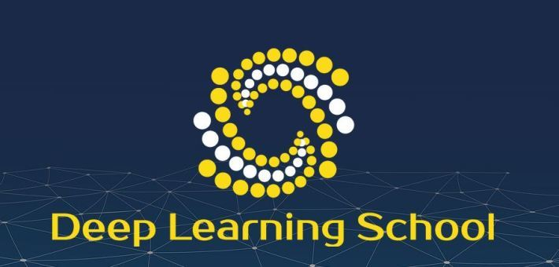

<h1 style="text-align:center">Deep Learning School</h1>

 

Офіціні ресурси:

<h4 align="center">Mail: oleksijomelcenko7@gmail.com</h4>

Школа поглибленого навчання (Deep Learning School) — кружок від бакалаврської програми Штучний Інтелект KSE, розрахований на старшокласинків, які в першу чергу цікавляться математикою та програмуванням, а також студентів, які хочуть отримати кваліфікацію у сфері ML/DL. Заняття ведуть студенти з кафедри **Штучного Інтелекту** та **Програмної Інженерії і Бізнес Економіки** Київської школи економіки.

Мета гуртка — познайомити слухачів з основними принципами Deep Learning(нейромереж) з великою кількістью практики та не менш важливою теорією.

## Для кого

* Перша частина для **школярів** і тих, хто давно закінчив ВНЗ.
В ньому будуть розбиратись з азів програмування на Python, потрібної математичної бази, роботи з таблицями(Pandas) та машинного/поглибленого навчання.
Особливо заняття будуть корисні для школярів 9-11 класи, які захоплюються математикою та програмуванням.
Учням, які успішно виконали 80 відсотків завдань на курсі і фінальний проєкт буде видано диплом про завершення курсу.

* **Друга частина курсу** розраховано на тих, хто вже має досвід у роботі з нейромережами. Також будемо раді бачити випускників першої частини нашої школи. Основна тема курсу NLP -- обробка текстів та аудіо. Учні, які успішно виконали 80% завдань на курсі і фінальний проєкт отримають диплом про закінчення потоку.

Не залежно від аудиторії, на яку спрямований кожен курс, будь-яка людина може подати заявку на проходження курсу, в якому вона зацікавлена 

## Де?

Навчання буде проходити на платформі GitHub Classroom

## Коли

Ітерація першого потоку буде починатись на початку травня 2024 року.

## Формат

На протязі всього курсу будуть проводитись лекцій раз на тиждень(день та час буде узгоджено з учасниками) в офлайн форматі на кампусі KSE, які також будуть записуватись і можна буде переглядати. Тривалість лекції - 1 година 20 хвилин, на першій частині буде розбиратись теорія, а вже на другій  реалізація теоретичних знань за допомогою програмування.
До того ж раз на тиждень будуть проводитись Office Hourse, на ких можна буде поставити будь-які питання лектору або асистентам курсу.

## Програма курсу

**Перша частина:**

1. Python: basics, Jupyter Notebook, Google Colab

2. Introduction to Linear Algebra. Vectors. Matrics and operations with them. NumPy library

3. Libraries Pandas & MatPlotlib. Basics of Machine Learning

4. Elements of n-dementional analysis. Gradient. Gradient descending. Linear models.

5. Introduction in Deep Learning. Perceptrons. Neur with sigmoid (and another activation functions).

6. Library PyTorch. Багатошарові нейроннімережі.

7. Навчання нейромереж на практиці. Cifar10, notMNIST

8. Convolutional Neural Networks. Convolutional layer. Pooling layer

9. Практика тренування нейромереж. Classification of road signs.

10. Transfer Learning. Popular architectures in Computer Vision.

11. Сегментація зображень. U-Net

12. Kaggle competitions

13. Object Detection. YOLOv3

14. Classic GAN. Нейронний перенос стилю

**Second Part:**

15. Basics methos of language processing

16. Word Embeddings

17. Рекуррентные нейронные сети

18. LSTM, GRU ячейки

19. Language models

20. Машинный перевод

21. Text2Speech

22. SuperResolution

23. Speech2Text

24. Практические советы по обучению нейросетей

25. Диалоговые системы

 
 
If you find any mistakes in this information Please write us. 
